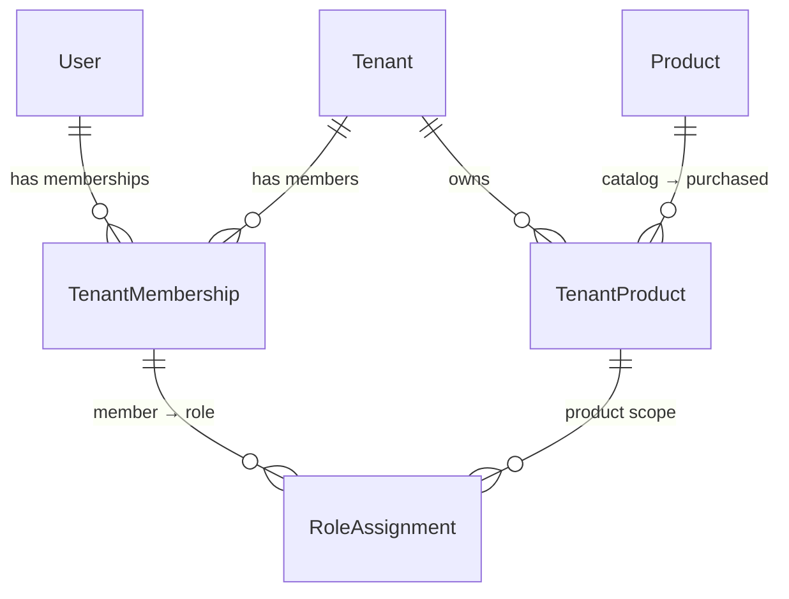

# Tenant & Product Access — v1 Design (RC Platform)

> **Audience**: system design + product + tech lead  
> **Stage**: v1 (lean, production-ready, no billing/SSO yet)  
> **Stack**: PostgreSQL + Prisma + Node/TS (assumed), multi-tenant row-level isolation

---

## 1) Context & Motives

- You are building a **single platform** with **three products** inside it:
  - **SB** = Survey Builder
  - **PM** = Project Management
  - **PMM** = Panel Management
- **Goals**:
  - World‑class product quality and developer ergonomics
  - **Strict tenant isolation** (each tenant’s data is theirs only)
  - **Users live once** globally; access is granted **per tenant, per product**
  - Add/remove products for a tenant easily (no schema churn)
  - Keep **infra cost in control** and avoid over‑engineering in v1
- **Non‑Goals in v1**: Billing/Stripe, SSO/SAML/OAuth, audit logs, API keys, fine‑grained permission bits.
  These can be added later without breaking the core model.

---

## 2) Minimal Data Model (6 tables)

We intentionally keep the catalog & RBAC lean while preserving scalability.

**Core Identity**
- `User` — global person record (email, passwordHash).
- `Tenant` — organization/account (e.g., “Research Connect USA”).
- `TenantMembership` — user belongs to a tenant.

**Catalog & Entitlement**
- `Product` — fixed catalog (code enum: `SB`, `PM`, `PMM`).
- `TenantProduct` — tenant has access to a product (status/dates).
- `RoleAssignment` — a tenant member’s **role for a specific product**.



**Enums**
- `ProductCode`: `SB`, `PM`, `PMM` (v1 uses an enum; adding a new product requires a migration, acceptable here).
- `AssignmentRole`: `OWNER`, `ADMIN`, `MANAGER`, `EDITOR`, `USER`, `VIEWER` (single role per member per product).

> **Why this model?**
> - Identity is centralized (`User`) → easy SSO later.
> - Entitlement is explicit (`TenantProduct`, `RoleAssignment`) → easy to add or revoke product access.
> - Minimal tables; avoids per‑product user tables and duplication.

---

## 3) Prisma Schema (relevant excerpt)

> Full file already agreed earlier; excerpt shown to align Cursor’s reasoning with the model.

```prisma
enum AssignmentRole {
  OWNER
  ADMIN
  MANAGER
  EDITOR
  USER
  VIEWER
}

enum ProductCode {
  SB   // Survey Builder
  PM   // Project Management
  PMM  // Panel Management
}

model User {
  id            String   @id @default(uuid())
  email         String   @unique
  passwordHash  String
  name          String?
  isActive      Boolean  @default(true)
  createdAt     DateTime @default(now())
  updatedAt     DateTime @updatedAt

  memberships   TenantMembership[]
}

model Tenant {
  id           String   @id @default(uuid())
  name         String
  slug         String   @unique
  isActive     Boolean  @default(true)
  tierCode     String?
  createdAt    DateTime @default(now())
  updatedAt    DateTime @updatedAt

  memberships  TenantMembership[]
  products     TenantProduct[]
}

model TenantMembership {
  id             String   @id @default(uuid())
  tenantId       String
  userId         String
  joinedAt       DateTime @default(now())
  isActive       Boolean  @default(true)

  tenant         Tenant   @relation(fields: [tenantId], references: [id], onDelete: Cascade)
  user           User     @relation(fields: [userId], references: [id], onDelete: Cascade)

  roleAssignments RoleAssignment[]

  @@unique([tenantId, userId])
  @@index([tenantId])
  @@index([userId])
}

model Product {
  id          String       @id @default(uuid())
  code        ProductCode  @unique
  name        String
  isActive    Boolean      @default(true)
  createdAt   DateTime     @default(now())
  updatedAt   DateTime     @updatedAt

  tenantLinks TenantProduct[]
}

model TenantProduct {
  id            String    @id @default(uuid())
  tenantId      String
  productId     String
  status        String    @default("active")  // "active" | "trial" | "canceled"
  licenseStart  DateTime  @default(now())
  licenseEnd    DateTime?

  tenant        Tenant    @relation(fields: [tenantId], references: [id], onDelete: Cascade)
  product       Product   @relation(fields: [productId], references: [id], onDelete: Cascade)

  roleAssignments RoleAssignment[]

  @@unique([tenantId, productId])
  @@index([tenantId])
  @@index([productId])
}

model RoleAssignment {
  id               String           @id @default(uuid())
  membershipId     String
  tenantProductId  String
  role             AssignmentRole
  grantedAt        DateTime         @default(now())

  membership       TenantMembership @relation(fields: [membershipId], references: [id], onDelete: Cascade)
  tenantProduct    TenantProduct    @relation(fields: [tenantProductId], references: [id], onDelete: Cascade)

  @@unique([membershipId, tenantProductId])
  @@index([tenantProductId])
}
```

---

## 4) End‑to‑End Flows

### 4.1 Tenant creation (backoffice or sign‑up wizard)
1. Create `Tenant { name, slug, tierCode? }`.
2. (Optional v1) Seed `TenantProduct` for default product(s), e.g. SB on `status="active"`.
3. No users yet; tenant exists.

### 4.2 User creation & onboarding (admin invites or self‑signup)
1. Create `User { email, passwordHash, name? }`.
2. Create `TenantMembership { tenantId, userId }`.
3. If the tenant already has active products (`TenantProduct`), create `RoleAssignment` for this `membershipId` **per product** with appropriate `role`.
   - Example: first member gets `OWNER` for all active products; later members get `ADMIN` or `EDITOR`.

> **Invariant**: exactly **one role per member per product** (`@@unique([membershipId, tenantProductId])`).

### 4.3 Login & portal access
1. User logs in → identify `User`.
2. User selects/activates a tenant (if they have multiple): resolve `TenantMembership`.
3. Query accessible products for this membership:
   - Join `RoleAssignment → TenantProduct → Product`.
   - Only include products where `status = "active"` and `(licenseEnd is null OR licenseEnd > now())`.
4. Show only the portals they can access (e.g., SB yes, PM no).

### 4.4 Buying an additional product later
1. Create/Upsert `TenantProduct { tenantId, productId, status: "active" }` (set dates if needed).
2. For members who should get access, create `RoleAssignment` rows (e.g., Owner/Admins by default).
3. On next login/refresh, those members see the new portal and get permissions per `role`.

### 4.5 Revoking/suspending a product
- Set `TenantProduct.status = "canceled"` or set `licenseEnd = now()`.
- Access automatically disappears (queries exclude canceled/expired).

---

## 5) Role Semantics (v1 default)

> Keep it simple and consistent across products. You can refine later per product.

| Role    | Powers (baseline across SB/PM/PMM)                                       |
|--------|---------------------------------------------------------------------------|
| OWNER  | Everything including member management and product settings               |
| ADMIN  | Manage product settings & teams; full content control                     |
| MANAGER| Manage projects/surveys/panels; approve/publish; assign tasks             |
| EDITOR | Create/edit content; cannot manage members                                |
| USER   | Contribute within assigned areas; limited edits                           |
| VIEWER | Read‑only                                                                 |

**Guideline**: Minimize OWNER/ADMIN assignments. Most members should be `MANAGER/EDITOR/USER/VIEWER`.

---

## 6) Authorization Implementation

### 6.1 Fast check in code (per request)
- You’ll typically carry a JWT with claims like:
```json
{
  "sub": "<userId>",
  "tenant_id": "<tenantId>",
  "products": [
    { "code": "SB", "role": "ADMIN" },
    { "code": "PM", "role": "VIEWER" }
  ],
  "exp": 1735900000
}
```
- Middlewares check `tenant_id` and role for the target portal/action.
- Refresh the token after role/product changes (or read from Redis on each request if you prefer).

### 6.2 RLS (Row Level Security) — **strongly recommended**
- Add `tenantId` to **every domain table** (e.g., `Survey`, `Project`, `Panel`).
- At request start, set the Postgres session var:  
  `SELECT set_config('app.tenant_id', '<tenant-uuid>', true);`
- Apply policy on each table:
```sql
ALTER TABLE "Survey" ENABLE ROW LEVEL SECURITY;

CREATE POLICY tenant_isolation ON "Survey"
USING (tenant_id = current_setting('app.tenant_id')::uuid)
WITH CHECK (tenant_id = current_setting('app.tenant_id')::uuid);
```
- This prevents cross‑tenant data leaks even if app code has a bug.

---

## 7) Key Queries & Snippets

### 7.1 Get accessible products for a member
```ts
const membership = await prisma.tenantMembership.findUnique({
  where: { tenantId_userId: { tenantId, userId } },
  include: {
    roleAssignments: {
      include: { tenantProduct: { include: { product: true } } }
    }
  }
});

const now = new Date();
const accessible = (membership?.roleAssignments ?? [])
  .filter(ra => {
    const tp = ra.tenantProduct;
    return tp.status === 'active' && (!tp.licenseEnd || tp.licenseEnd > now);
  })
  .map(ra => ({
    code: ra.tenantProduct.product.code, // "SB" | "PM" | "PMM"
    role: ra.role
  }));
```

### 7.2 Require product access in middleware
```ts
async function requireProductRole(req, res, next) {
  const { userId } = req.auth;
  const { tenantId } = req.ctx;
  const productCode = 'SB'; // example

  const allowed = await prisma.roleAssignment.findFirst({
    where: {
      membership: { tenantId, userId, isActive: true },
      tenantProduct: {
        tenantId,
        product: { code: productCode },
        status: 'active',
        OR: [{ licenseEnd: null }, { licenseEnd: { gt: new Date() } }]
      }
    },
    select: { role: true }
  });

  if (!allowed) return res.status(403).json({ error: 'No access to SB' });
  req.ctx.productRole = allowed.role;
  next();
}
```

### 7.3 Grant product to tenant and auto-assign roles
```ts
await prisma.$transaction(async (tx) => {
  const tp = await tx.tenantProduct.upsert({
    where: { tenantId_productId: { tenantId, productId } },
    update: { status: 'active', licenseEnd: null },
    create: { tenantId, productId, status: 'active' }
  });

  const ownersAndAdmins = await tx.tenantMembership.findMany({
    where: { tenantId, isActive: true },
  });

  for (const m of ownersAndAdmins) {
    await tx.roleAssignment.upsert({
      where: { membershipId_tenantProductId: { membershipId: m.id, tenantProductId: tp.id } },
      update: { role: 'ADMIN' },
      create: { membershipId: m.id, tenantProductId: tp.id, role: 'ADMIN' }
    });
  }
});
```

---

## 8) Indexes & Constraints (performance & correctness)

- `TenantMembership`: `@@unique([tenantId, userId])`, indexes on `tenantId`, `userId`.
- `Product`: `@unique(code)` ensures stable routing/flags.
- `TenantProduct`: `@@unique([tenantId, productId])`, indexes on `tenantId`/`productId` for entitlement lookups.
- `RoleAssignment`: `@@unique([membershipId, tenantProductId])` prevents duplicate/ambiguous roles.
- Add `(tenantId, ...)` composite indexes to your hot domain tables (e.g., `Survey(tenantId, status)`), since most queries are tenant‑scoped.

---

## 9) Routing & UX

- Portals may live on separate subpaths/subdomains; use `tenantId` + `productCode` to build URLs.
  - Example: `https://app.domain.com/sb` (Survey Builder), `https://app.domain.com/pm` (Project Management).
- The top‑level app fetches **Member’s Product List** on tenant switch and renders only available portals.
- Deny deep links if a user lacks a `RoleAssignment` for that product in the active tenant.

---

## 10) Error Scenarios & Guardrails

- **User has no membership in tenant** → 403 with hint “not a member of this tenant”.
- **Membership exists but no `RoleAssignment`** → 403 with hint “no access to this product”.
- **Product canceled/expired** → hide from UI; API returns 403/404 for routes under that product.
- **Duplicate role attempt** → 409 because of `@@unique([membershipId, tenantProductId])`.
- **Tenant inactive** → block all operations; return 403 with “tenant inactive”.

---

## 11) Migration & Roadmap (how to extend without pain)

- **Billing**: Add fields on `TenantProduct` (subscriptionId, provider, seatsPurchased) and a `BillingEvent` table. No need to change identity or roles.
- **SSO/OAuth**: Add `UserIdentity` and `Session` tables. `User` remains the single source of truth.
- **Fine‑grained permissions**: Add `ProductRole` (+ `permissions Json`) and point `RoleAssignment` to it instead of enum. Migrate existing roles by code.
- **Audit Log**: Add `AuditLog(tenantId, actorUserId, action, resource, details)`; write on mutating actions.
- **Feature flags**: `TenantFeature(tenantId, code, enabled)` or use plan metadata.

---

## 12) Testing & QA Checklist (v1)

- [ ] A new tenant has **no products** by default (or exactly the seeded default).
- [ ] First invited member gets `OWNER` or `ADMIN` in the tenant’s active products.
- [ ] A member can view only portals with an active `RoleAssignment` + `TenantProduct.status='active'`.
- [ ] Buying a product immediately exposes the portal and permissions after role assignment.
- [ ] Canceling/expiring a product hides the portal and blocks API access.
- [ ] RLS policies exist on **every domain table** with `tenant_id` + tests try cross‑tenant access (should fail).
- [ ] All unique constraints hold (no duplicate memberships or role assignments).
- [ ] JWT is refreshed after role/product changes (or middleware re-reads cache).

---

## 13) Cursor Guidance (how to use this doc in codegen)

- When generating endpoints, **always carry `tenantId`** in context and **resolve membership first**.
- When generating portal routes, **guard by product** using `RoleAssignment` + `TenantProduct`.
- Any table generated for SB/PM/PMM must include a **`tenantId` column** and inherit the RLS policy pattern.
- Prefer **upsert** for enabling products and role grants to keep ops idempotent.
- Keep **role semantics consistent** across products in v1; avoid product‑specific role names until v2.

---

## 14) Worked Example (User X buys SB, later PM)

1. **Seed**: products `SB`, `PM`, `PMM`; tenant `demo-tenant` has only `SB` active.
2. **User X created** → `User` row.
3. **Join tenant** → `TenantMembership(tenantId=demo, userId=X)`.
4. **Assign SB role** → `RoleAssignment(membershipId, tenantProductId(SB), role='ADMIN')`.
5. **Login** → JWT contains `{ tenant_id: demo, products: [{code:'SB', role:'ADMIN'}] }`. X sees **only SB**.
6. **After 1 month**, tenant buys **PM** → `TenantProduct(demo, PM, status='active')`.
7. **Grant PM role** to X → `RoleAssignment(..., tenantProductId(PM), role='VIEWER')`.
8. **Next login/refresh** → JWT products include `SB` + `PM`. X now sees **both SB and PM**, with different powers.

---

## 15) Minimal Seed (already provided separately)

- Creates the 3 products (`SB`, `PM`, `PMM`) and a `demo-tenant`.  
- Users and memberships are intentionally created later by your flows.

---

## 16) Final Notes (cost & scale)

- **One DB** with **row-based multi-tenancy** and **RLS** is cost‑efficient and safe in v1.
- Index by `(tenantId, ...)` on all product domain tables for predictable performance.
- If a tenant grows huge, you can shard/move them later without changing the logical model.
- Keep enums (`ProductCode`, `AssignmentRole`) stable; any new values require a migration (OK tradeoff here).

---

**This document is the v1 contract for tenant, product, and role flows.**  
Follow it strictly to prevent auth drift, cross‑tenant leaks, and role confusion.
